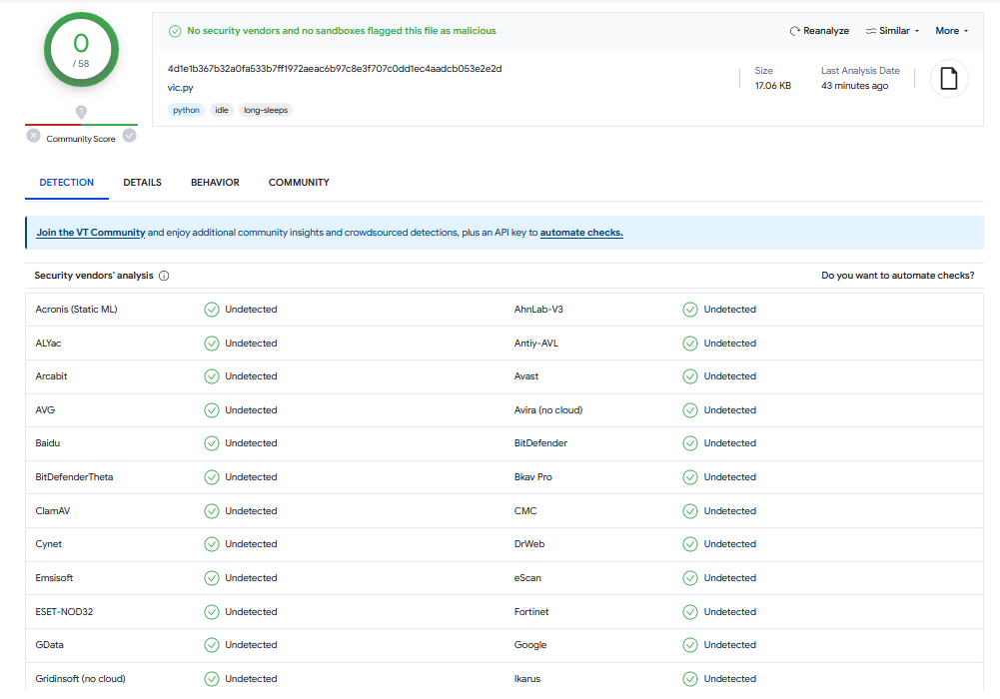

# LLMarshal 0.1
**by SPTH, January 2024**

This is a **LLM-based anti-virus program** which can fight against
new-age LLM-based computer viruses,
such as the [LLMorpher family](https://github.com/SPTHvx/SPTH/blob/master/articles/files/LLMorpher.txt)

## Description

Large Language Models, such as GPT, can be used by computer viruses to
encode and mutate the virus code autonomously. In this case, the entire
virus code can be written in natural language (such as english), and GPT
translates the english prompts into malicious code that is executed.
 
The infected file itself do not contain any malicious codes, all malicious
parts of the virus are stored as strings. That makes these new viruses
potentially difficult to detect with conventional methods. One of the
main issue is that it is unclear how to extract code from the English
language description.
  
Here I show how to use GPT itself to defend again LLM-based viruses.
The idea is to search for malicious prompts in the infected file, and
directly use GPT to analyse and classify the file. I demonstrate this
simple idea using LLMarshal, which works surprisingly well, because
GPT can extract code from language and interpret it.

LLMarshal analyses the structure of the file, it searches whether the
Python code contains the execution of strings, then it tracks whether the
strings origin from GPT. If yes, it collects the prompts and uses
GPT-4 to decide whether the prompts are malicious.

It is a very simple demo, but it wont be too difficult to fill in a few
voids and create a much more powerful defence mechanism.

## Files

   |*Filename*|*Description*|
   |---------------|-----------|   
   | `LLMarshal.py`   | Full demo of the antivirus program | 
   | `test1_malicious.py` | File infected with LLMorpher 3 | 
   | `test2_malicious.py` |  File infected with LLMorpher 3 |
   | `test3_malicious.py` | File infected with LLMorpher 1 |
   | `test4_harmless.py` |  A file that uses GPT, but in a harmless way. |
   

## Motivation

I write this code because I am surprised that no antivirus program at
Virustotal (58 different programs) can detect any of the new LLMorpher
viruses. Together with my belief that this might become a serious problem
in the future
[Mikko Hypponen seems to agree](https://thenextweb.com/news/mikko-hypponen-5-biggest-ai-cybersecurity-threats-2024) and implicitly [Mustafa Suleyman](https://www.the-coming-wave.com/) discussed these ideas. Therefore, I show a simple way how to defend against such codes.

Fighting bad AI with good AI - that's the spirit here. I am curious 
whether these future techniques can be defeated without LLMs that exploit
the fluidity between natural and computer languages.

   

